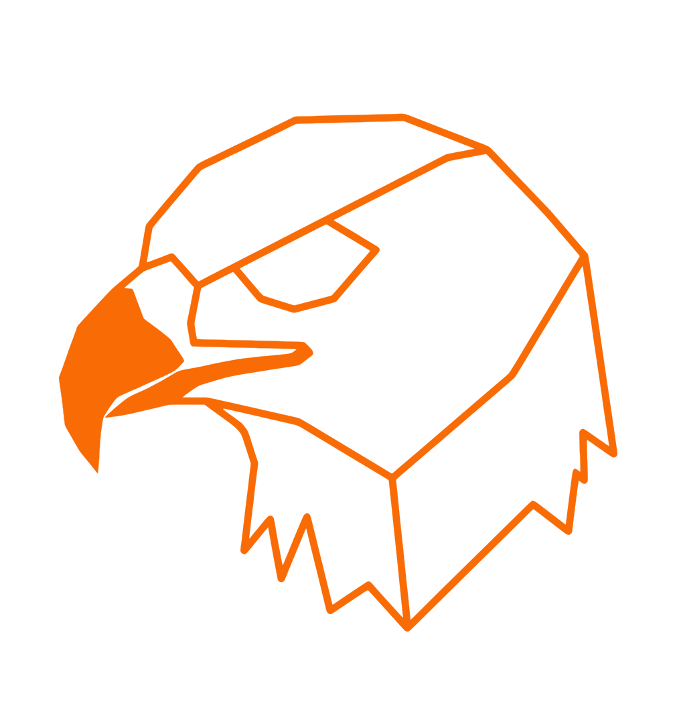

<div align="center">
  
  <h1>yggl</h1>
</div>

**Pronounced: "eagle"** — yggl = yggdrasil + collaboration

Share local ports with teammates over an encrypted peer-to-peer mesh. No cloud relay, no port forwarding, no VPN to configure. Works behind NAT on any network.

Built on [Yggdrasil](https://yggdrasil-network.github.io/) — every node gets a stable IPv6 address derived from its public key. Connections are end-to-end encrypted by the network itself.

```sh
npm install -g yggl
yggl share 3000
# → http://[200:xxxx::1]:3000
```

→ **[Full documentation](packages/yggl/README.md)**
